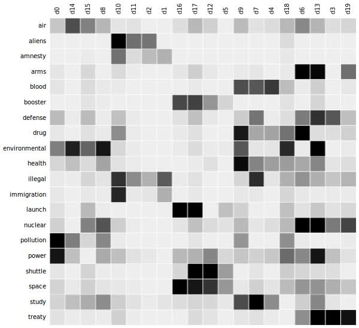

*Probabilistic topic modelling* is a method to categorise a  given set of documents, that is a collection of texts. Such a set of documents could be a collection of news articles. Every news article would then be assigned a topic. A topic is a group of documents that use similar words. An example of a topic would be "parliament", "government", "spending"--politics.

In other words, given a set of documents $D$, topic modelling gives a mapping

$$
f: D \rightarrow \{1, \dots, k\},
$$
where $k$ is a number of topics.

{ width=50% }

# Why should I care?

Topic modelling is helpful to

- discover patterns / themes across documents,
- automatically annotate documents,
- organise and summarise texts, and
- find similar documents to a given one.

**Most importantly, it helps to get an overview of ever larger data archives.**

As such, topic modelling can be applied to all tasks that have to process large numbers of documents. It helps in journalism to grasp large amounts of news. In social science, it may help with coding interview data.

# Latent Dirichlet Allocation (LDA)

[Latent Dirichlet Allocation (LDA)](http://www.jmlr.org/papers/volume3/blei03a/blei03a.pdf) is the most popular topic modelling method.

The idea is simple: LDA sees documents as distributions of topics, and topics as distributions of words.

This assumption is made because every document usually covers a range of topics, to different extents. Likewise, a topic is made up of a mixture of features, usually words in the case of text processing.

These distributions can also be seen as a matrix approximation. Given a document-term matrix $D$ containing the counts of words in each documents, we seek an approximation $D \approx TW$. Here, $T$ is a document-topic matrix $T$ and topic-word matrix $W$.

You see that this assumption requires a number of topics to be known beforehand, to determine the dimensions of the matrices.

To obtain the statistical distributions, LDA assumes [Dirichlet priors](https://en.wikipedia.org/wiki/Dirichlet_distribution) over documents and topics, with parameters $\alpha$  and $\beta$, where the former is for documents and the latter for topics. Broadly speaking, the higher (resp. lower) $\alpha$, the more (resp. fewer) topics documents consists of. Similarly, the higher $\beta$, the more words are made topics of.

## Training the model

Having described our topic model, the problem left is inferring the assumed statistical distributions, that is *training our model*.

Statistical inference is a standard task in statistics, and there exist ample ways to do so, such as *Monte Carlo simulation* and *Maximum Likelihood*.

I don't personally yet understand the mathematical details, so I won't cover this in this article. Yet, I expect that this will be very similar to Maximum Likelihood estimation, except that for LDA, we're handling [Dirichlet-multinomial distributions](https://en.wikipedia.org/wiki/Dirichlet-multinomial_distribution).

A great, in-depth explanation can be found here: [Probabilistic Topic Models (ACM Communications)](https://cacm.acm.org/magazines/2012/4/147361-probabilistic-topic-models/fulltext)

#  Tools for topic modelling

Topic modelling is implemented in a range of machine learning toolkits.

##  Gensim

The most prominent topic modelling toolkit is [Gensim](https://radimrehurek.com/gensim/), a Python library.

You may want to use Gensim in combination with the well-known [Natural Language Toolkit](https://www.nltk.org/).

Gensim also provides *Hierarchical Dirichlet Process* (HDP). HDP is akin to LDA, but finds an appropriate number of topics automatically.

A good tutorial can be found here: [Topic Modeling and Latent Dirichlet Allocation (LDA) in Python](https://towardsdatascience.com/topic-modeling-and-latent-dirichlet-allocation-in-python-9bf156893c24)

## Scikit-learn

[Scikit-learn](https://scikit-learn.org/), a prominent all-purpose machine learning toolkit, provide its [own implementation of topic modelling](https://scikit-learn.org/stable/modules/decomposition.html) algorithms.

A hands-on guide can be found here: [Topic Modeling with Scikit Learn](https://medium.com/mlreview/topic-modeling-with-scikit-learn-e80d33668730)

## pyLDAvis

[pyLDAvis](https://github.com/bmabey/pyLDAvis) is a Python library to visualise and better understand the results of LDA modelling.

You can find a nice introduction here: [Topic Modeling in Python](https://towardsdatascience.com/end-to-end-topic-modeling-in-python-latent-dirichlet-allocation-lda-35ce4ed6b3e0)